summary: La sécurité, par où commencer ? Install party
id: securite-intro
categories: devsecops, security
tags: devoxxfr, GBU-7756
status: Published 
authors: David Aparicio
Feedback Link: https://github.com/davidaparicio/davidaparicio.github.io/issues

# La sécurité, par où commencer ? Install party 🎉
<!-- ------------------------ -->
## Présentation 
Duration: 3

Votre entreprise a connu une croissance inattendue, des carnets de commandes qui débordent, un tas d'idées nouvelles de projets, et avec la crise actuelle outre-atlantique touchant les GAFAM, la conjecture n'est pas favorable à recruter massivement. 

De plus, votre dernier produit de l'équipe a connu un succès fou, DevoxxGPT. Tous les médias en parlent, les serveurs tiennent tant bien que mal à la charge, et après quelques analyses de logs, vous remarquez que certains petits malins réussissent à bénéficier de l'offre commerciale, sans débourser le moindre sou. 


Avec l'euphorie des développeurs, et l'engouement des utilisateurs, vous avez mis en production de nouvelles fonctionnalités dans la précipitation, sans revue préalable, ni la réalisation de test d'intrusion.

Vous ne voyez plus qu'une solution, face à la charge de travail déjà colossale dans l'équipe, l'application immédiate de la méthologie DevSecOps: pour sécuriser votre outil et maintenir la position de l'entreprise sur son piédestal. Car vous devez éviter, à tout prix pour votre image, la fuite de toutes vos données clientes, ainsi que vos secrets de fabrication, comme ce fût le cas pour [Twitch, le 6 Octobre 2021](https://arstechnica.com/information-technology/2021/10/twitch-admits-to-major-leak-exposing-source-code-creator-earnings/).

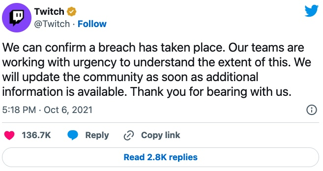

En guise d'encouragement, votre CTO cite Google avec son livre [Building Secure and Reliable Systems (xxvi | Preface)](https://sre.google/books/building-secure-reliable-systems/): "Parce que la **sécurité** et la **fiabilité** sont l'**affaire de tous**, nous visons un large public : les personnes qui conçoivent, mettent en œuvre et maintiennent les systèmes. Nous remettons en question les lignes de démarcation entre les rôles professionnels traditionnels des développeurs, des architectes, des SRE des administrateurs de systèmes et des ingénieurs en sécurité."
<!--Because security and reliability are everyone's responsability, we're tartegeting a broad audience: people who design, implement, and maintain systems. We're challenging the dividing lines between the traditional professional roles of developers, architects, SRE, systems administrators and security engineers.-->

__Objectif:__ Vous vous retrouvez donc, à devoir mettre en place cette méthologie, en plus de votre activité habituelle...

<!-- ------------------------ -->
## Qui sommes-nous ?
Duration: 1

### David Aparicio

Ingénieur passionné en Informatique, diplômé INSA Lyon 2014, après deux années passées à UNICAMP au Brésil, participe activement à la communauté, à travers des Meetups et des conférences. Sa devise: « Nul développeur n'est censé ignorer la sécurité ».

J'ai rejoint [OVHcloud](https://www.ovhcloud.com/fr/) en juillet 2019 en tant que DataOps au sein de l’équipe GIS-Datalake.

* [Mon LinkedIn](https://fr.linkedin.com/in/davidaparicio1)
* [Mon site web](https://davidaparicio.gitlab.io/)

### Christopher Aparicio

Responsable du Back-end chez [42Crunch](https://42crunch.com/) et développeur de la solution d’Audit et de Scan

* [Mon LinkedIn](https://www.linkedin.com/in/christopher-aparicio-37069b111/)

__PS:__ Comme vous pouvez en doutez, les entreprises qui nous emploient, continuent à recruter activement ;-)

<!-- ------------------------ -->
## Motivations 
Duration: 3

### Le saviez-vous ?

Une [étude de 2017](https://archive.fosdem.org/2019/schedule/event/crypto_pitfalls/attachments/slides/3209/export/events/attachments/crypto_pitfalls/slides/3209/crypto_pitfalls.pdf) a démontré que
**98%** des snippets de code sur StackOverFlow concernant la thématique de la sécurité ne sont pas sûrs. Un comble n’est-ce pas ?

Cela est même devenu un sujet de conférence au FOSDEM en 2019 [Comment éviter les pièges cryptographiques par la conception ?](https://archive.fosdem.org/2019/schedule/event/crypto_pitfalls/).

### Et l'IA souffre des mêmes biais

Une [étude de 2021](https://cyber.nyu.edu/2021/10/15/ccs-researchers-find-github-copilot-generates-vulnerable-code-40-of-the-time/) de l'université de New York a montré que **40%** du code proposé par [GitHub Copilot](https://github.com/features/copilot/) n'était pas sécurisé, présentant des failles applicatives.

Donc [ChatGPT](https://chat.openai.com/) ne devrait pas tarder à subir ce genre d'études avec un même ordre de grandeur.

### Afin d'éviter ceci

Le déroulement de la cyberattaque par un rançongiciel contre le [CHU de Rouen en 2019 (thread @zigazou)](https://twitter.com/zigazou/status/1269889177178574852).

Ou un autre exemple, parmi tant qu'autres sur la Sécurité Dès la Conception, extrait du [magazine le 44e Virus Info (2020)](http://www.acbm.com/virus/num_44/VirusInfo44.pdf)


<!-- ------------------------ -->
## OWASP
Duration: 2

Un constat, en l'espace de 8 ans, le [Top 10](https://owasp.org/Top10/fr/) des attaques **n'a pas évolué**. Ce classement est realisé et mis à jour par l'[OWASP, Open Web Application Security Project](https://owasp.org/), une organisation internationale à but non lucratif qui se consacre à la sécurité des applications web. 

42Crunch a realisée une [vidéo](https://info.42crunch.com/112119-webinar-owasp-recording) sur le [Top10 des API (2019)](https://owasp.org/www-project-api-security/)


<!-- ------------------------ -->
## Objectifs
Duration: 1

### Ce que nous allons réaliser durant ce workshop
- Suivre la méthologie DevSecOps
- Modéliser la menace
- Outiller son éditeur de texte ou IDE favori 
- Appliquer la sécurité as code, en ayant une confiance nulle (Zéro Trust)
- Programmer des tests de sécurité
- Configurer des tests statiques et dynamiques des applications 
- Activer la signature numérique 
- Transférer les binaires de manière sécurisée
- Mettre en place des scans et des patchs de sécurité
- Étudier les Audits de sécurité
- Monitorer et alerter sur les menaces actuelles

<!-- ------------------------ -->
## DevSecOps
Duration: 1

Pour catégoriser les outils et les différentes étapes, de la DEV jusqu’à la PROD, en passant par le cycle de vie et la maintenance de l’application, on se base sur les bonnes pratiques de la “US DoD Enterprise DevSecOps Reference Design” (du Département de la Défense américaine), publiées à l’adresse suivante : [https://public.cyber.mil/devsecops/](https://public.cyber.mil/devsecops/)

Et nous allons plus précisément nous attarder sur le diagramme/**Figure 1** à la page 19/89. Êtes-vous prêt.e.s ? Alors allons-y ! 

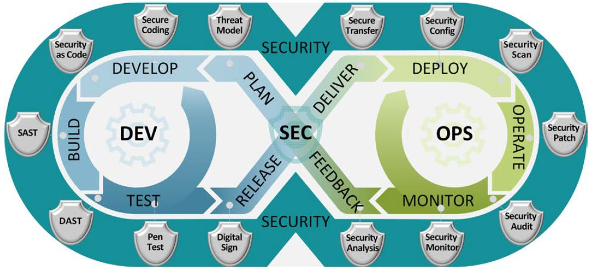

<!-- ------------------------ -->
## Modélisation
Duration: 3

### Planifier: Modélisation de la menace (le fameux Threat Model)

Avant de partir dans les spécifications de notre MVP et la programmation itérative, nous devons réunir toute l’équipe
autour d’un ou plusieurs ateliers sur l’Analyse du Risque. Mozilla nous propose le format de 30 minutes du [RRA : Analyse/évaluation rapide des risques](https://infosec.mozilla.org/guidelines/risk/rapid_risk_assessment.html) (anglais). 

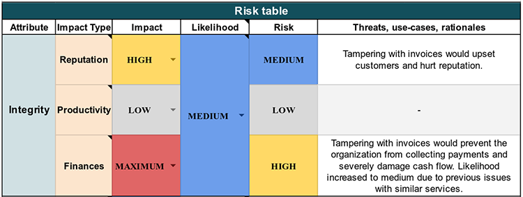

Et les guides de l’ANSSI, comme l'[“Agilité & Sécurité Numériques”](https://www.ssi.gouv.fr/uploads/2018/11/guide-securite-numerique-agile-anssi-pa-v1.pdf) présente les ateliers à réaliser ainsi que le vocabulaire adéquat, comme la définition du DICT: 
* Disponibilité
* Intégrité
* Confidentialité
* Preuve

et donne quelques cas pertinents, par [exemple](https://cloudsecdocs.com/devops/how_to/design/rra/#3-identifying-and-measuring-risks)

Vous pouvez désormais avoir quelques user stories "sécurité".


Pour vous aider, voici un tableau d’identification de l’attaquant :

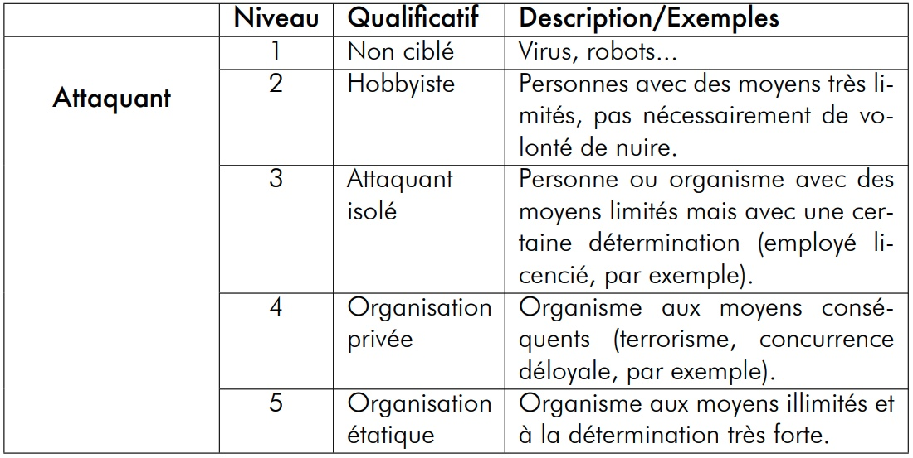

Enfin, pour illustrer une attaque d’ampleur préparée par un attaquant isolé, nous vous recommandons l’écoute ultérieure de la fiction de France Inter [« La nuit tous les hackers sont gris »](https://www.radiofrance.fr/franceinter/podcasts/affaires-sensibles/la-nuit-tous-les-hackers-sont-gris-8287559).

Pour notre atelier, on vous laisse ces informations pour réaliser ces spécifications ultérieurement.

<!-- ------------------------ -->
## Ex: Créer SECURITY.md
Duration: 5

Après ces définitions, passons à la pratique en rédigeant un petit document `SECURITY.md` dans votre repôt de code. La "Security Policy", politique de sécurité décrit comment vous allez supporter vos versions et surtout permettre à vos utilisateur.trice.s de pouvoir remonter des bugs ou des failles de sécurité à travers un canal sécurisé avec vous, développeur.se.

Un exemple pour le [proxy Traefik](https://github.com/traefik/traefik/blob/master/SECURITY.md) ou celui d'un [autre repôt](https://github.com/davidaparicio/namecheck/blob/main/SECURITY.md). Comme autre source d'inspiration, voici la documentation K8s sur le sujet: [Kubernetes Security and Disclosure Information (en)](https://kubernetes.io/docs/reference/issues-security/security/)

__Objectifs de cette étape__: 
* Copier l'une d'entre elles pour la modifier ultérieurement
* Préparer un formulaire de signalement (facultatif)

<!-- ------------------------ -->
## Réduire la surface d’attaque
Duration: 6

### Planifier: Réduction de la menace

Réduire la surface d'attaque est très courant dans le monde de la sécurité, d’autant plus, depuis l’essor des containers. Snyk a dénombré [78% des vulnérabilités d’applications](https://snyk.io/opensourcesecurity-2019), dans les dépendances profondes/internes (c’est à dire, à minima, les dépendances de vos dépendances). Notamment, les images Docker “node” ou “postgres” peuvent embarquer les failles de Debian ou d’Alpine, puisqu’elles sont construites par-dessus. Il en va de même pour les containers basés sur d’autres systèmes d’exploitation.

Pour notre **MVP** ou bien même pour nos **projets finaux**: Faut-il implémenter une solution complète d’authentification, avec le choix de l’**algorithme de chiffrement** en BDD ainsi que les sels (salt) à utiliser ? Ou pouvons-nous nous contenter d’utiliser celui du **framework** ? Un mot de passe fort est-il indispensable (et donc oubliable par l’utilisateur) ? Pourquoi ces questions ? Car la désactivation des fonctionnalités inutiles permet de limiter les risques de sécurité. 

De plus, nous savons que les mots de passe sont une contrainte pour la plupart de nos clients. Dans le papier [“Secrets, Lies, and Account Recovery [...]”](https://goog.gl/v1dBmj) à la conférence internationale WWW’15, Google relève que plus d’1/5 de ses utilisateurs oubliaient leurs mots de passe de leur compte ainsi que la réponse à la question secrète dans les 3 premiers mois. 

Plus récemment, en 2021, ANSSI recommande l’utilisation de [coffre-forts (KeePass) et de l’authentification multi-facteurs](https://www.ssi.gouv.fr/particulier/guide/recommandations-relatives-a-lauthentification-multifacteur-et-aux-) au lieu de forcer le changement régulier des mots de passe (car contre-productif).  Microsoft, Apple et Google ont annoncé le [5 Mai 2022](https://fidoalliance.org/apple-google-and-microsoft-commit-to-expanded-support-for-fido-standard-to-accelerate-), le souhait de supprimer les mots de passe, dès 2023 grâce à la norme WebAuth ainsi que FIDO.

De ce fait, est-ce possible et acceptable pour votre projet d’utiliser de l’**OpenID Connect**, de l’OAuth2 ? Ou au contraire un outil SaaS comme [Magic](https://magic.link/), un logiciel open source dit **passwordless** tel que [passport-magic-login](https://github.com/mxstbr/passport-magic-login) qui envoie un lien temporaire à l’email demandé ? Sinon, dans le cas où vous utilisez une authentification basique : votre outil se protège-t-il bien contre les [injections](https://owasp.org/www-community/attacks/SQL_Injection) ? Tolère-t-il des limites d’essais/compte ? Bannit-il des IP après un trop gros nombre de tentatives ? Utilise-t-il des sels avec des algorithmes de chiffrement à jour ?

Ce sont les questions que nous devons nous poser, selon le risque pris et le type d’attaquant. Cet exemple concerne la brique d’authentification, mais cela s’applique également aux autres éléments qui composent votre système.

Poursuivons avec la suite de l'atelier :)

<!-- ------------------------ -->
## Ex: Extensions (IDE)
Duration: 5

### Développer : Code sécurisé

Dans la philosophie du “Security Shift-Left”, nous allons nous outiller afin de remonter directement dans l’éditeur ou l’IDE du développeur. Il existe déjà les “linters” pour chaque langage de programmation (ShellCheck, golangci-lint, etc ...), mais également des extensions dédiées à la sécurité et la liste est longue (pourtant pas [exhaustive): SonarLint, Sonatype Nexus IQ, Snyk, Qualys IaC, RedHat Dependency Analytics, GitHub Code Scanning, JFrog XRay... Et la liste complète pour VSCode est [disponible](https://s.42l.fr/vs_sec)

D’autant plus, que leur nom [change régulièrement](https://devdojo.com/yoda/top-vs-code-extensions-for-application-security-in-2021) au fil des rachats, exemple avec DeepCode.AI (acheté par Snyk) ou Mend Advise (ex-WhiteSource), ou sont spécifique à un langage comme C#/XML avec Microsoft Security IntelliSense, node.JS avec npm audit, Redshift Security pour Java, [gosec](https://golangci-lint.run/usage/linters/#gosec) pour Go.

Pour les utilisateurs de Github Copilot, s'il est installé dans votre IDE, l'[extension](https://marketplace.visualstudio.com/items?itemName=GitHub.copilot) devrait vous faire quelques remontées par rapport à des attaques classiques (injections SQL et cie) d'après leur site...

__Objectifs de cette étape__: 
* Installer une ou plusieurs extensions pour votre éditeur ou IDE favori.
* Par exemple, [Snyk Code (lien pour VSCode)](https://marketplace.visualstudio.com/items?itemName=snyk-security.snyk-vulnerability-scanner)
* Si vous utilisez souvent OpenAPI (Swagger), nous vous recommendons l'installation de l'[extension de 42Crunch (lien pour VSCode)](https://marketplace.visualstudio.com/items?itemName=42Crunch.vscode-openapi)


<!-- ------------------------ -->
## Virage à gauche toute
Duration: 4

### Développer : Sécurité comme Code
D’après O’Reilly, SaC (Security as Code) consiste à intégrer la sécurité dans les flux DevOps, alias CI/CD. Néanmoins, si l’outil n’est pas trop gourmand en ressources, il peut être installé dans l’éditeur. Car nous avons des ordinateurs plus puissants, grâce à l’apparition des puces ARM ou les IDE en ligne, comme AWS Cloud9, Gitpod, ou GitHub Codespaces. Au niveau des containers sécurisés, des implémentations existent avec [gVisor](https://gvisor.dev/), les [Kata Containers](https://katacontainers.io/) et les [Confidential containers](https://youtu.be/G0SwSWKGyuM).

D’une part, l’application de la configuration (HBAC, RBAC, règle pare-feu) peut-être une opération critique en cas d’oubli ([bucket S3 accessible en public sur Internet](), [base de données sans mot de passe](https://blog.newsblur.com/2021/06/28/story-of-a-hacking/)). Il est préférable de déclarer son besoin avec des fichiers et de laisser l’orchestrateur les réaliser plutôt qu’agir de manière impérative sur le système. 

Par exemple, le projet [Cilium](https://cilium.io/) permet d’interagir avec le réseau et d’appliquer des politiques de sécurité. De plus, les maillage de services (services-mesh) comme Istio, Traefik maesh ou Solo.io avec GlooEdge génèrent automatiquement des certificats SSL et ne laissent passer ainsi que les communications sécurisées entre vos containers. D'[autres projets](https://platform9.com/blog/the-ultimate-guide-to-using-calico-flannel-weave-and-cilium/) existent comme: [Flannel](https://github.com/flannel-io/flannel), [Calico](https://github.com/projectcalico/calico) ou [Weave](https://github.com/weaveworks/weave).

D’autre part, les commandes `docker scan`, `trivy image mon_Image_Docker:tag` analysent les vulnérabilités connues de votre Dockerfile. Avant de pousser du code contenant des secrets, un hook peut-être installé avec [GitGuardian](https://gitguardian.com/), [ggshield](https://github.com/GitGuardian/ggshield), [Trivy](https://github.com/aquasecurity/trivy) (`trivy fs —security-checks secret ./`) ou le projet [awslabs/git-secrets](https://github.com/awslabs/git-secrets).
Comme l’erreur est humaine, il est préférable d’automatiser toutes ces actions et analyses.

Au final, en plus de la modélisation de l'attaquant et des risques, il faut aussi prendre en compte les différents flux, avoir des diagrammes d'architecture, comme celui ci-dessous... justement, c'est notre prochain sujet.

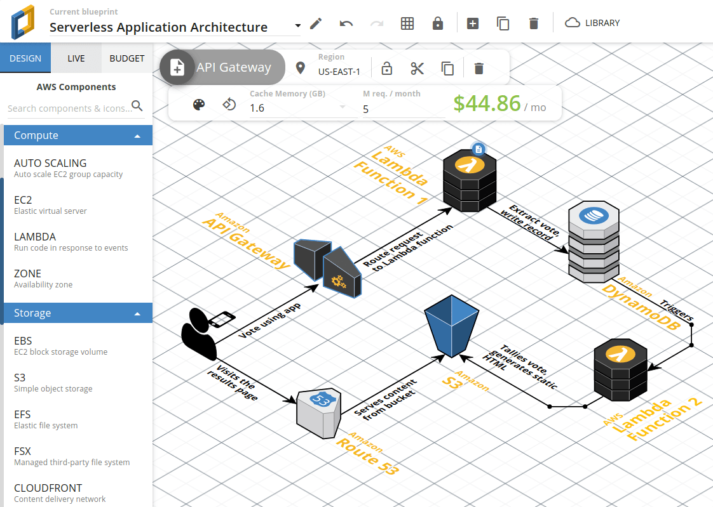

<!-- ------------------------ -->
## Ex: Diagramme de flux
Duration: 7

### Développer : Environnement sécurisé

Nous allons définir les règles pour passer de la sécurité périmétrique ([modèle de la forteresse de Vauban](https://www.clever-cloud.com/blog/guests/2015/06/16/the-end-of-the-fortress-metaphor/)) avec l'approche de la confiance Zéro/[Zero trust](https://www.redhat.com/fr/topics/security/what-is-zero-trust) (modèle de l'aéroport)

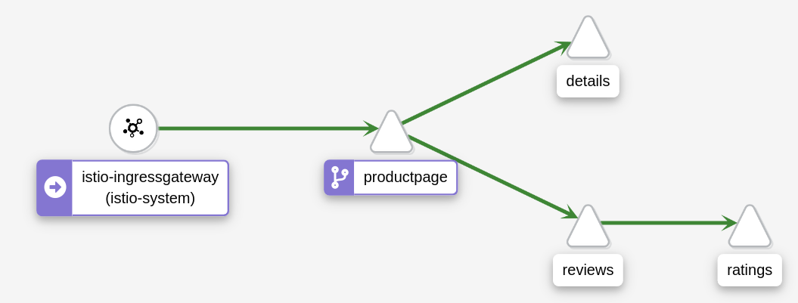

__Objectifs de cette étape__: 
* Définir les interactions de votre projet avec:
    * les autres microservices
    * les bases de données (SQL/NoSQL/Clé-Valeur)
    * les messages brokers (Kafka/Pulsar/RedPanda & cie)
    * les services d’annuaire (LDAP, Kerberos)
* Coder ces interactions (en déclarant/ouvrant les flux)
    * à l'ancienne avec les règles pare-feu (iptables, ufw, etc)
    * avec votre maillage de services ([Service Mesh](https://www.infoq.com/fr/articles/service-mesh-ultimate-guide/)) comme:
        * Istio avec Kiali
        * Gloo Mesh, Linkerd Nginx Mesh
        * Kuma, Consul, AWS App Mesh
    * ou avec [Cilium & eBPF](https://www.youtube.com/watch?v=JJ1bFnJenms)
* Bonus: Étudier les projets [SPIFFE & SPIRE](https://spiffe.io/), [Hashicorp Boundary](https://www.datocms-assets.com/2885/1666193737-hashicorp_zts_whitepaper.pdf) pour faire du Zero-Trust, ainsi que [CrowdSec](https://www.crowdsec.net/blog/kubernetes-crowdsec-integration)

<!-- ------------------------ -->
## Traffic sortant
Duration: 4

### Attention même au traffic sortant, comme le DNS

La réponse se cache dans la banalité, comme nous pouvons le lire en images

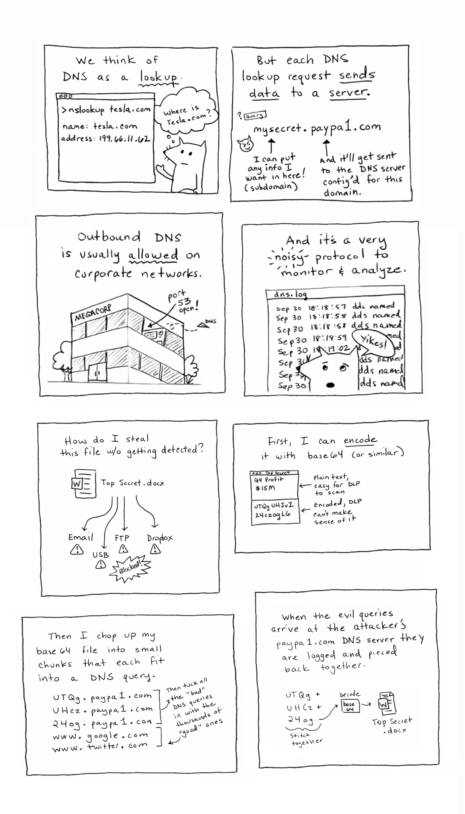

__Objectifs de cette étape__: 
* Définir les interactions, même celles qui sembleraient être légitimes
* Reprendre l'exercice précédent, si besoin ;)

<!-- ------------------------ -->
## Compilation
Duration: 3

### Compilation : Tests statiques de sécurité des applications

Le podium des SAST est [Checkmarx](https://checkmarx.com/), [SonarQube](https://www.sonarsource.com/products/sonarqube/), [Veracode](https://www.veracode.com/), suivi de [OpenSCAP](https://www.open-scap.org/), [Insider CLI](https://github.com/insidersec/insider) (couvrant OWASP Top 10), [PMD - Don’t shoot the messenger](https://pmd.github.io/), [Mend Advise (ex-WhiteSource)](https://mend.io/), [Argon Supply Chain](https://www.argon.io/) qui a rejoint [Aqua](https://blog.aquasec.com/argon-supply-chain-security), [Brakeman](https://brakemanscanner.org/), [Codacy](https://www.codacy.com/), [Contrast Security](https://www.contrastsecurity.com/), [CyberRes](https://www.microfocus.com/en-us/cyberres), [Find Security Bugs](https://find-sec-bugs.github.io/) (Java), [Grammatech](https://www.grammatech.com/), [HCL AppScan](https://www.hcltechsw.com/appscan), [JIT.io](https://www.jit.io/), [Klocwork](https://www.perforce.com/products/klocwork), [LGTM.com](https://lgtm.com/) racheté par [Github](https://github.blog/2022-08-15-the-next-step-for-lgtm-com-github-code-scanning/), [Perforce SAST](https://www.perforce.com/blog/kw/what-is-sast), Redshift renommé récemment en [Software Secured](https://www.softwaresecured.com/) probablement pour un différent juridique avec AWS, [Snyk](https://snyk.io/), [SpectralOps](https://spectralops.io/), [Synopsys Coverity](https://www.synopsys.com/software-integrity/security-testing/static-analysis-sast.html), [slscan.io](https://slscan.io/), [42Crunch API SAST](https://42crunch.com/free-tools/). 


Exemple: lorsqu'on crée un nouveau projet sur Gitlab. Ce dernier nous propose dès l'[initiation du projet](https://gitlab.com/projects/new#blank_project), d'activer le GitLab SAST.

Pour compléter, nous vous recommandons de visiter le site de la [Fondation OWASP qui a un tableau (en anglais)](https://owasp.org/www-community/Vulnerability_Scanning_Tools) sur ce sujet

Au niveau des systèmes de contrôle de version pour la gestion du code source, [GitLab a son propre SAST intégré](https://docs.gitlab.com/ee/user/application_security/sast/): principalement gratuit (à quelques fonctionnalités près) depuis la version GitLab 13.3.

Github a son équivalent avec [CodeQL](https://codeql.github.com/) (ou vous pouvez intégrer un outil tiers à travers de la [Marketplace](https://github.com/marketplace?type=)).
Il est activable facilement à partir du lien : `https://github.com/MON_USER/MON_REPO/security/code-scanning`

<!-- ------------------------ -->
## Ex: Scan durant CI
Duration: 10

### Compilation : Tests statiques de sécurité des applications

Nous allons activer [CodeQL sur Github](https://codeql.github.com/) pour venir réaliser un scan lors des PR sur la branche `main`, ainsi que de manière hebdomadaire.

Si besoin, aidez-vous du site web [Crontab Guru](https://crontab.guru/#17_03_*_*_1) pour définir vos lancements automatiques. Voici un exemple de workflow (GitHub Action), GitHub lancera le scan tous les lundis à 3h17 du matin.

```YAML
name: "Security Scan (CodeQL)"

on:
  push:
    branches: [ "main" ]
  pull_request:
    branches: [ "main" ]
  schedule:
    - cron: '17 03 * * 1'

jobs:
  analyze:
    name: Analyze CodeQL
    runs-on: ubuntu-latest
    permissions:
      actions: read
      contents: read
      security-events: write

    strategy:
      fail-fast: false
      matrix:
        language: [ 'go' ]

    steps:
    - name: Checkout repository
      uses: actions/checkout@v3

    # Initializes the CodeQL tools for scanning.
    - name: Initialize CodeQL
      uses: github/codeql-action/init@v2
      with:
        languages: ${{ matrix.language }}

    - name: Autobuild
      uses: github/codeql-action/autobuild@v2

    - name: Perform CodeQL Analysis
      uses: github/codeql-action/analyze@v2
```

__Objectifs de cette étape__: 
* Activer l'action GitHub de CodeQL
* Définir le language de programmation de scan
* Valider l'exécution correcte de sa GitHub action en réalisant une PR
* Modifier le jour et l'heure du cron (facultatif)
* Activer un deuxième outil, comme gosec pour Go, ou SonarCloud (facultatif)

<!-- ------------------------ -->
## Résultat
Duration: 1

### Le résultat sur PR (GitHub)

Visible directement sur [Github](https://github.com/davidaparicio/namecheck/pull/10) ou sur l'image ci-dessous.

Note: CodeQL donne le même style de résultat que cet exemple avec GoSec. J'en ai profité pour activer la version gratuite de SonarCloud ;-)


<!-- ------------------------ -->
## Ex: Corriger une erreur
Duration: 2

### Tenter de corriger une erreur remontée

Visible directement sur [Github](https://github.com/davidaparicio/namecheck/security/code-scanning/3) ou sur l'image ci-dessous.

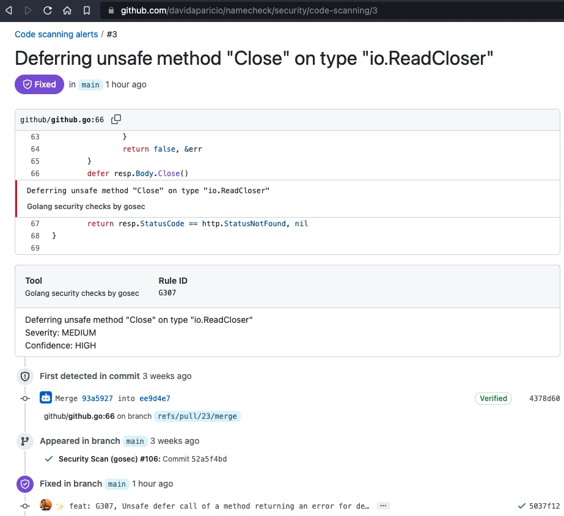

__Objectifs de cette étape__: 
* Si vous avez le temps,
* Fixer une des erreurs éventuelles remontées par CodeQL
* Committer dans une nouvelle branche, et créer une PR
* Vérifier que votre action a corrigé l'alerte remontée dans `https://github.com/VOTRE_PSEUDO/VOTRE_REPO/security/code-scanning/1`

<!-- ------------------------ -->
## Ex: Test E2E
Duration: 10

### Compilation : Tests basiques de sécurité des applications (de bout en bout)


En effet, vous vous rappelez des conséquences de l'attaque contre fournisseur de données pour DevoxxGPT: [NewsBlur](https://blog.newsblur.com/2021/06/28/story-of-a-hacking/). Pour éviter la même mésaventure, vous prenez les devant. Tester votre déploiement, en vérifiant les Best Practices en Sécurité ()

__Objectifs de cette étape__: 
* Codez deux petites fonctions de test qui valide (SUCCÈS) si elle n'arrive à se connecter à votre BDD sans identifiants, et ceux par défaut comme `admin:admin`
* Intégrez ce test dans votre CI/CD, pour valider la bascule Bleue/Verte ([blue/green](https://traefik.io/glossary/kubernetes-deployment-strategies-blue-green-canary/)) avant la mise à jour progressive/[rolling update](https://kubernetes.io/blog/2018/04/30/zero-downtime-deployment-kubernetes-jenkins/) (facultatif)


[Source la timeline, le blog de NewsBlur - lien direct](https://blog.newsblur.com/2021/06/28/story-of-a-hacking/)

<!-- ------------------------ -->
## Tests
Duration: 3

### Test : Tests dynamiques de sécurité des applications
Comme vous pouvez vous en douter, ce thème converge un peu avec le sujet précédent. Au lieu d’analyser le code, l’outil va tester votre application de l’extérieur (en mode boîte noire/blackbox), tentant d’exploiter votre programme en cours d’exécution. Les logiciels DAST sont: [OWASP Zed Attack Proxy (ZAP)](https://owasp.org/www-project-zap/) avec l’opérateur Kubernetes [banzaicloud/dast-operator](https://github.com/banzaicloud/dast-operator), [Dagda](https://github.com/eliasgranderubio/dagda) avec [ClamAV](https://www.clamav.net/), [Indusface WAS](https://www.indusface.com/web-application-scanning.php), [Invicti](https://www.invicti.com/) ex-Netspaker, [Acunetix](https://www.acunetix.com/), [Astra Pentest](https://www.getastra.com/pentest), [PortSwigger](https://portswigger.net/), [Probely](https://probely.com/), [Detectify](https://detectify.com/), [AppCheck](https://appcheck-ng.com/), [Hdiv Security](https://hdivsecurity.com/) racheté par [Datadog](https://investors.datadoghq.com/news-releases/news-release-details/datadog-signs-definitive-agreement-acquire-hdiv-security) en 2022, [AppScan](https://www.hcltechsw.com/appscan), [Checkmarx DAST](https://checkmarx.com/checkmarx-dast/), [Rapid7 InsightAppSec](https://www.rapid7.com/products/insightappsec/), [MisterScanner](https://www.misterscanner.com/), [XSStrike](https://github.com/s0md3v/XSStrike).

Au niveau des API, la version Ultimate de GitLab propose le DAST API (REST, SOAP, GraphQL), aussi pour les plates-formes de [Probely](https://probely.com/), [Intelligence/API Security Tester](https://devpost.com/software/api-security-tester) de Postman, [Shift Left Security](https://datanews.levif.be/ict/actualite/les-fondateurs-de-zionsecurity-creent-une-nouvelle-entreprise-de-securite/article-news-1265961.html), [42Crunch](https://42crunch.com/). Une remarque concernant [42Crunch](https://42crunch.com/), l’entreprise française veut être l’outil audit-scan-protéger de l’API, à l’instar de [Trivy](https://github.com/aquasecurity/trivy), prévenir-protéger-détecter-réagir, pour la partie Cloud Native.

<!-- ------------------------ -->
## Ex: Scan d'API
Duration: 15

### Démonstrations des fonctionnalités de 42Crunch

<!-- ------------------------ -->
## Pentest
Duration: 3

### Test : Pentest

Sauf si vous avez une équipe de pentesteurs en interne, ou vous êtes experts des outils [Kali Linux](https://www.kali.org/), [Parrot Security](https://www.parrotsec.org/), [hetty](https://hetty.xyz/) ou [Burp Suite Pro](https://portswigger.net/burp/), [SuperTruder](https://github.com/ElSicarius/SuperTruder), [ffuf](https://github.com/ffuf/ffuf), [Metasploit](https://www.metasploit.com/)..., il est possible de demander à une entreprise spécialisée de réaliser les pentests ou vous pouvez participer à un programme de [Bug Bounty](https://geekflare.com/bug-bounty-platforms/): [YesWeHack](https://www.yeswehack.com/), [Yogosha](https://yogosha.com/), [Open Bug Bounty](https://www.openbugbounty.org/), [Hackerone](https://www.hackerone.com/), [Bugcrowd](https://www.bugcrowd.com/), [SafeHats](https://app.safehats.com/enterprises/programs), [Intigriti](https://www.intigriti.com/), [Synack](https://www.synack.com/).

Même les grands groupes utilisent ces techniques. En effet, Google a annoncé récemment (Février 2023) avoir attribué plus de 12 millions de dollars de récompenses en 2022 pour l’identification de plus de 2 900 problèmes de sécurité (cf [ZDNet](https://www.zdnet.fr/actualites/google-s-aligne-financierement-sur-microsoft-pour-son-programme-de-bug-bounty-39954634.htm) et le tweet de [Stormshield](https://twitter.com/Stormshield/status/1630206661167050754)).


<!-- ------------------------ -->
## Signature

Duration: 3

### Distribution : Signature numérique

SCA (Software Composition Analysis) et les SBOM (Software Bill Of Materials) permettent de générer la nomenclature logicielle : l’ensemble des packages du système d’exploitation ainsi que vos dépendances présentes dans votre programme ou dans votre image Docker. 

Le site [OWASP CycloneDX](https://cyclonedx.org/tool-center/) recense [le standard](https://github.com/CycloneDX/bom-examples) dont les implémentations sont : [Syft d’Anchore](https://github.com/anchore/syft), [tern-tools/tern](https://github.com/tern-tools/tern), [microsoft/sbom-tool](https://github.com/microsoft/sbom-tool), [SPDX SBOM Generator](https://github.com/opensbom-generator/spdx-sbom-generator) et les [produits](https://www.csoonline.com/article/3667483/8-top-sbom-tools-to-consider.html) de [Dependency Track](https://dependencytrack.org/), [FOSSA](https://fossa.com/lp/simplify-sbom-generation-fossa), [Mend](https://www.mend.io/sbom/), [Rezilion](https://www.rezilion.com/platform/sca-dynamic-sbom/), [TauruSeer](https://www.tauruseer.com/platform/dynamic-software-bill-of-materials-SBOM), [Vigilant Ops](https://www.vigilant-ops.com/products/).


En effet, l’ENISA (Agence de l’Union européenne pour la cybersécurité) en analysant les attaques récentes (“Sunburst” avec Orion de SolarWinds, Mimecast CDN, Codecov, Kaseya, NotPetya) ont montré que les chaînes d’approvisionnement logicielles trop longues sont également une menace sérieuse. Dans le rapport de l’[ENISA](https://www.enisa.europa.eu/publications/threat-landscape-for-supply-chain-attacks), nous pouvons lire: “une organisation peut être vulnérable à une attaque de la chaîne d’approvisionnement logicielles, même si ses propres défenses sont assez bonnes. Par conséquent, les attaquants tentent d’explorer de nouvelles voies potentielles pour les infiltrer en se déplaçant vers leurs fournisseurs et en faisant d’eux une cible”.

<!-- ------------------------ -->
## Ex: SBOM
Duration: 10

### Génération des SBOM avec GoReleaser et Syft
Reprenons notre programme écrit en Go, de tout à l’heure et y ajoutons une GitHub Action pour générer le SBOM avec Syft, pendant la génération des binaires par GoReleaser.

```YAML
name: Release (GoReleaser)

on:
  push:
    tags:
      - '*'

jobs:
  goreleaser:
    permissions:
      contents: write
      packages: write
      deployments: write
      id-token: write # needed for signing the images with GitHub OIDC Token **not production ready**

    runs-on: ubuntu-latest
    strategy:
      matrix:
        go-version: [1.19]

    needs: [test] # sequential

    steps:
      - name: Checkout
        uses: actions/checkout@v3
        with:
          fetch-depth: 0
      - name: Set up Go
        uses: actions/setup-go@v3
        with:
          go-version: ${{ matrix.go-version }}
          cache: true
      - name: Set up QEMU
        uses: docker/setup-qemu-action@v2

      - name: Login to Docker Hub
        uses: docker/login-action@v2
        with:
          #registry: ghcr.io
          username: ${{ secrets.DOCKERHUB_USERNAME }}
          password: ${{ secrets.DOCKERHUB_TOKEN }}

      - uses: sigstore/cosign-installer@v2.8.1          # installs cosign
      - uses: anchore/sbom-action/download-syft@v0.13.3 # installs syft
      - name: Run GoReleaser
        uses: goreleaser/goreleaser-action@v4
        with:
          distribution: goreleaser
          version: latest
          args: release --rm-dist
        env:
          # https://goreleaser.com/errors/resource-not-accessible-by-integration/
          GITHUB_TOKEN: ${{ secrets.GH_PAT }}
```

__Objectifs de cette étape__: 
* Activer l'action GitHub de GoReleaser
* Lancer la pipeline pour générer les binaires
* Explorer le fichier SBOM créé

<!-- ------------------------ -->
## Transfert
Duration: 3

### Transfert : Transfert sécurisé
Les gestionnaires d’artefacts, paquets d’OS, d’images Docker, les plus connus sont [JFrog Artifactory](https://jfrog.com/artifactory/), [Sonatype Nexus](https://www.sonatype.com/products/nexus-repository), [ProGet](https://inedo.com/proget). 

Il est possible de renforcer l’intégrité en certifiant vos images [Docker avec Notary](https://blog.octo.com/la-signature-dimages-docker-sur-une-registry-avec-notary/). Plus d’informations sur la documentation spécifique [“Content trust in Docker”](https://docs.docker.com/engine/security/trust/)

<!-- ------------------------ -->
## Déploiement
Duration: 3

### Déploiement : Configuration sécurisée
Au niveau des SCM (Software Configuration Management Tools), les classiques sont : [Ansible](https://www.ansible.com/), [Puppet](https://www.puppet.com/), [Chef](https://www.chef.io/), mais également [Bamboo](https://www.atlassian.com/software/bamboo), [TeamCity](https://blog.jetbrains.com/teamcity/2019/03/teamcity-and-plastic-scm/), [Octopus Deploy](https://octopus.com/), [Rudder](https://www.rudder.io/), [Juju/JAAS](https://jaas.ai/), [SaltStack](https://saltproject.io/), [CFEngine](https://cfengine.com/), [Auvik](https://www.auvik.com/), [SolarWinds](https://www.solarwinds.com/). 

Sans oublier de sécuriser vos secrets avec [Hashicorp Vault](https://www.vaultproject.io/), [Akeyless Vault](https://www.akeyless.io/), [Thycotic Secret Server renommé Delinea](https://delinea.com/products/secret-server), les projets [Mozilla/sops](https://github.com/mozilla/sops) et [cloudflare/gokey](https://github.com/cloudflare/gokey) ou à travers de votre cloud provider par exemple [AWS Secrets Manager](https://aws.amazon.com/fr/secrets-manager/). 

Enfin pour maintenir une infrastructure immutable (IaC), il existe ArgoCD (avec le [concept de Synchronisation](https://www.cncf.io/blog/2020/12/17/solving-configuration-drift-using-gitops-with-argo-cd/)), [Driftctl de CloudSkiff](https://driftctl.com/), [Magalix racheté par Weaveworks GitOps](https://www.weave.works/blog/magalix-joins-weaveworks-to-bring-policy-to-gitops), [Fairwinds Insights](https://www.fairwinds.com/insights), [le projet GitHub Kubediff de Weaveworks](https://github.com/weaveworks/kubediff). 

La combinaison [Trivy+Cosign+Kyverno](https://neonmirrors.net/post/2022-07/attesting-image-scans-kyverno/) peut être utilisée pour imposer un déploiement sur Kubernetes d’une image docker sans vulnérabilité, avec un scan récent inférieur à X jours. Nous vous invitons à lire ce [billet de blog](https://neonmirrors.net/post/2022-07/attesting-image-scans-kyverno/)

<!-- ------------------------ -->
## Scan
Duration: 3

### Déploiement : Scans de sécurité
[Shodan.io](https://shodan.io/) est un site assez connu qui crawle Internet à la recherche de ports ouverts, de failles de sécurité connues. [FullHunt.io](https://fullhunt.io/) est aussi une plate-forme pour découvrir tous vos équipements connectés à Internet et votre surface d’attaque. 

Enfin pour les infrastructures Kubernetes, nous pouvons utiliser les scanners de [quay/clair](https://github.com/quay/clair), [Trivy](https://aquasecurity.github.io/trivy/) ou [Falco](https://falco.org).

<!-- ------------------------ -->
## Patch
Duration: 3

### Opération : Patchs de sécurité
Pour activer les patchs de sécurité pour les environnements “pets”, vous pouvez utiliser vos playbooks [Ansible](https://www.ansible.com/) (avec [AWX](https://github.com/ansible/awx)/[Ansible Tower](https://www.ansible.com/products/controller) ou [HP Squest](https://hewlettpackard.github.io/squest/)), [SaltStack](https://saltproject.io/), [Puppet](https://www.puppet.com/), [Chef](https://www.chef.io/), ou [Rudder](https://www.rudder.io/). 

Pour la partie “cattle” alias Cloud Native, vous pouvez utiliser votre pipeline CI/CD, [ArgoCI](https://argoproj.github.io/), [Flux](https://fluxcd.io/), [Tekton](https://tekton.dev/) avec la nouvelle image Docker construite, avec vos procédures de mise à jour habituelles (rolling update).

<!-- ------------------------ -->
## Audit
Duration: 3

### Surveillance : Audit de sécurité et des bonnes pratiques
En open source, il existe les projets [Popeye](https://github.com/derailed/popeye), [Polaris](https://github.com/FairwindsOps/polaris), [kube-score](https://github.com/zegl/kube-score), [Falco](https://falco.org/docs/rules/) et [Trivy](https://aquasecurity.github.io/trivy/v0.29.2/docs/misconfiguration/scanning/) pour Kubernetes.

Pour le multi-cloud [nccgroup/ScoutSuite](https://github.com/nccgroup/ScoutSuite) et [Cloud Security Suite](https://github.com/SecurityFTW/cs-suite), ou [Prowler](https://github.com/prowler-cloud/prowler) pour AWS/Azure, et le NIST [OpenSCAP](https://github.com/OpenSCAP/openscap). Libhunt en recense d'[autres](https://www.libhunt.com/r/ScoutSuite), comme [Linux Security](https://linuxsecurity.expert/tools/scout2/alternatives/) mais une partie est orientée pour les infrastructures spécifiques à AWS, ou non opensourcé comme Cloud Security Suite.

Si vous ou vos clients en avez besoin, vous pouvez passer des certifications normatives pour vos produits: ISO/CEI 27001 - 27017 - 27018, PCI, HITRUST, CSA STAR, HDS. 

Pour la robustesse SI/logiciel: CSPN, CC EAL 3+, CC EAL 4+. 

Enfin les qualifications des services SSI: SecNumCloud, PSCE, PRIS, PDIS, PASSI, PSHE.

<!-- ------------------------ -->
## Surveillance
Duration: 3

### Surveillance : Sécurité monitorée
Le logiciel open source [Falco](https://falco.org/) permet de surveiller l’activité de Kubernetes et détecter des comportements anormaux ou malicieux. Nous vous recommandons de visionner la conférence de [Kris Nova](https://archive.fosdem.org/2020/schedule/event/kubernetes/) au FOSDEM 2020 [“ Fixing the Kubernetes clusterfuck - Understanding security from the kernel up”](https://youtu.be/6NhHnVYpOFw) (en anglais). Les Système de détection d’intrusion (IDS), sont aussi pratiques, les projets [CrowdSec](https://www.crowdsec.net/), [suricata](https://suricata.io/), [fail2ban](https://www.fail2ban.org/), [OSSEC](https://www.ossec.net/), [Wazuh](https://wazuh.com/), [Snort](https://www.snort.org/), [pfSense](https://www.pfsense.org/), [Tripwire Enterprise](https://www.tripwire.com/products/tripwire-enterprise), [Samhain](https://www.la-samhna.de/samhain/), [Security Onion](https://securityonionsolutions.com/) valent la peine d’être consultés. 

Pour l’ensemble de l’infrastructure, un système SIEM (Security information and event management) est indispensable. [Splunk](https://www.splunk.com/), [Elastic Security](https://www.elastic.co/security), [IBM QRadar](https://www.ibm.com/products/qradar-siem), [AlienVault USM](https://www.unifiedthreatworks.com/USM-Appliance) ou [SolarWinds Threat Monitor](https://www.solarwinds.com/security-event-manager/use-cases/threat-detection) sont dans ce domaine. 

Si vous devez vous connecter en SSH sur votre infrastructure, passez par une machine intermédiaire, dite de rebond, qui apporte la gestion d’utilisateurs/groupes, l’auditabilité ainsi que la traçabilité des actions. [OVHcloud](https://www.ovhcloud.com/fr/) a opensourcé leur projet de [bastion sur GitHub](https://github.com/ovh/the-bastion/)

<!-- ------------------------ -->
## Veille technologique
Duration: 3

### Retour : Analyse de sécurité
Nous recommandons de maintenir une veille technologique quotidienne ainsi que la lecture des CVE sur les sites [OpenCVE.io](https://www.opencve.io/), [CERT-FR](https://www.cert.ssi.gouv.fr/). La plate-forme [Feedly.com](https://feedly.com/) propose une [“Threat Intelligence”](https://feedly.com/i/landing/cybersecurity) sur différents thèmes (abonnement payant). En complément, [ANSSI](https://www.ssi.gouv.fr/) a créé le projet libre [OpenCTI.io](https://github.com/OpenCTI-Platform/opencti) et [AlienVault OTX](https://otx.alienvault.com/) présente les menaces actuelles dans le cybermonde. Et pour finir, voici quelques podcasts en français, [NoLimitSecu](https://www.nolimitsecu.fr/), [La French Connection](https://securite.fm/), [Le comptoir Sécu](https://www.comptoirsecu.fr/podcast/), [RadioFrance](https://www.radiofrance.fr/societe/tech-web/cybersecurite) a proposé quelques explications sur l’attaque récente d’un rançongiciel à l’encontre de La [Poste Mobile](https://www.radiofrance.fr/franceinter/sept-questions-pour-comprendre-le-piratage-de-l-operateur-la-poste-mobile-et-ses-consequences-6393466).

<!-- ------------------------ -->
## Ex: Veille
Duration: 10

### Explorons les outils suivants
* [OpenCVE.io](https://www.opencve.io/)
* [AlienVault OTX](https://otx.alienvault.com/)

avec des logins spécialement créés pour DevoxxFR 2023

(DISCLAMER: ne pas rentrer d'informations "sensibles" vu que ce sont des comptes partagés ;-D )

* OpenCVE.io, login: devoxx@zici.fr/devoxxFR2023
* otx.alienvault.com, login: devoxxFR2023/devoxxFR2023

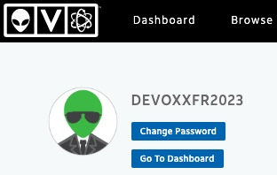

<!-- ------------------------ -->
## Cycle de vie
Duration: 3

### Fin de vie : Donnez une date d'échéance à vos projets
Voici une vue d’ensemble rapide sur une liste d’outils (non exhaustive) qui vont vous accompagner durant le cycle de vie du projet : de la conception jusqu’à la **fin de vie de votre logiciel**. Cette dernière étape est également __indispensable__. Sinon votre produit vivra trop longtemps, au-delà de la maintenance de vos dépendances, mais aussi de votre système d’exploitation. Les exemples à ce sujet sont nombreux: les banques ont payé les mises à jours étendues de **Windows XP** en 2014 car ce système d’exploitation équipait toujours [90% des distributeurs automatiques de billets](https://www.numerama.com/politique/28852-windows-xp-distributeurs.html). 

Ajoutons encore la panne globale du système météorologique de l’aéroport d’Orly, le 7 Novembre 2015, qui a empêché les avions de décoller ou atterrir, et qui tournait toujours sur [Windows 3.1](https://www.lemondeinformatique.fr/actualites/lire-le-trafic-aerien-d-orly-paralyse-a-cause-d-une-panne-systeme-windows-31-62953.html).

Mettre les applications à jour, permet à la fois d’obtenir les nouvelles features (comme la version 2.37 de [git](https://github.blog/2022-06-27-highlights-from-git-2-37/)) et les derniers patchs de sécurité (ex: OpenSSL 3.0.5 doit corriger d’une faille potentielle plus grave que celle de [Heartbleed](https://www.theregister.com/2022/06/27/openssl_304_memory_corruption_bug/) ou les multiples vulnérabilités dans le noyau Linux d’Ubuntu du 15 juillet 2022, [CERTFR-2022-AVI-645](https://www.cert.ssi.gouv.fr/avis/CERTFR-2022-AVI-645/))

<!-- ------------------------ -->
## Ex: Crash & Burn
Duration: 15

### Gagner en confiance en ses sauvegardes


Vous vous souvenez à nouveau des conséquences de l'attaque contre fournisseur de données pour DevoxxGPT: [NewsBlur](https://blog.newsblur.com/2021/06/28/story-of-a-hacking/). Pour éviter une mésaventure, vous prenez les devant: Tester de manière fréquente vos procédures de snapshot backup/restore.

__Objectifs de cette étape__: 
* Lister ce qui est indispensable pour votre sauvegarde (état mais aussi fichiers de configuration/secrets chiffrés)
* Automatiser la procédure qui réalise vos sauvegardes
* Tester de manière régulière la procédure qui charge vos sauvegardes
* Profitez-en pour tester votre toute dernière base de code en même temps, la branche principale main/master (facultatif)

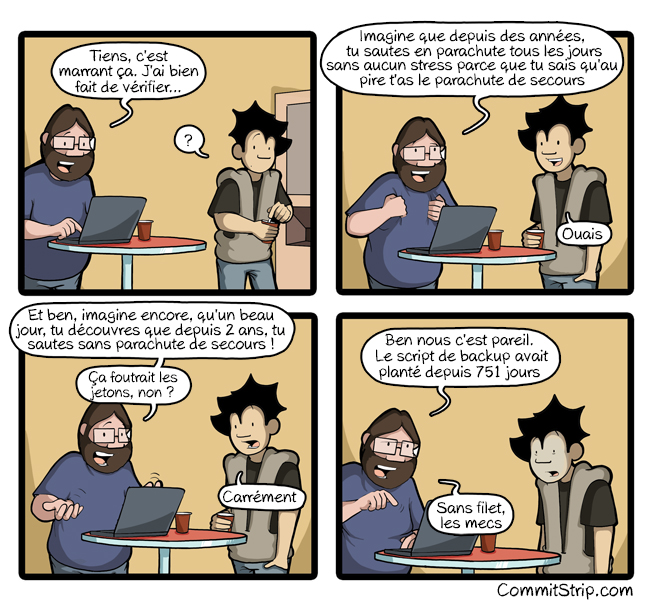

[Source de la BD, CommitStrip - lien direct](https://www.commitstrip.com/fr/2016/09/05/do-we-have-a-back-up-in-the-audience/?setLocale=1)

<!-- ------------------------ -->
## Bonnes pratiques
Duration: 3

### Si nous devions donner une petite liste de bonnes pratiques

* Diminuer surface d’attaque (scratch, distroless, ubi-minimal)
* Principe de moindre privilège (!root, 1 user = 1 appli)
* Défense en profondeur (bastion, traceability, siem)
* Détection de connexion, proposer/activer MFA
* Pas de configuration/permissions par défaut (K8s, [MongoDB](https://www.theregister.com/2016/04/25/mexico_voter_data_breach/))
* Pas de secrets dans les Docker images ou les repositories Git (Vault, .gitignore)
* Pas de données sensibles dans les GUI (RGPD + permettre la captation durant une visio/conférences)
* Ne pas afficher de stacktrace (pas debug | Fail securely)
* Ni de version/nom de framework
* Vérifier les entrées/sorties des clients/noeuds/microservices (injection/XSS, protocoles)
* Faire des backups régulièrement et déconnectées du réseau
* Mettre à jour infra/docker images (CI/CD|[GitOps](https://www.infoq.com/news/2020/02/wksctl-kubernetes-gitops/))
* Surveiller le traffic sortant (comme le DNS qui n'est pas souvent = [Exfiltration de données possible](https://twitter.com/rsobers/status/1293539543115862016) / [DNSSEC](https://blog.ovhcloud.com/an-introduction-to-dnssec/))
* Joker: Utiliser une PaaS 🇪🇺 si vous ne souhaitez pas vous embêter avec la sécurité: CleverCloud/OVHcloud/Scaleway

<!-- ------------------------ -->
## Cloud Native
Duration: 2

Si nous devions synthétiser une partie des outils, dans le monde Cloud Native, voici le résultat
Car la [CNFC Landscape](https://landscape.cncf.io/) ne donne pas la même chose si on choisit Industrie = Sécurité ^^

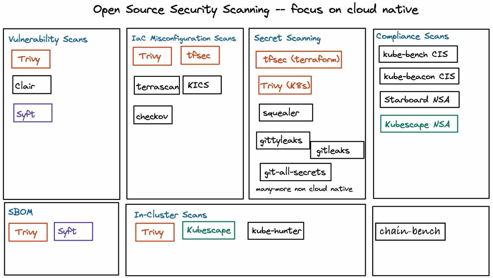

<!-- ------------------------ -->
## Félicitations
Duration: 2


Votre CEO ainsi que votre CTO vous félicient pour ces actions préventives et actives pour renforcer les produits de l'entreprise, et surtout votre produit phare: DevoxxGPT. Vous pouvez être fier.e pour ces exploits menés avec brio !


[Source de la BD, CommitStrip - lien direct](https://www.commitstrip.com/fr/2022/12/09/a-whole-new-world/?setLocale=1)

<!-- ------------------------ -->
## Références
Duration: 4

### Pour approfondir vos connaissances

* [ANSSI](https://www.ssi.gouv.fr/administration/bonnes-pratiques/) ([Sécurité Agile](https://www.ssi.gouv.fr/guide/agilite-et-securite-numeriques-methode-et-outils-a-lusage-des-equipes-projet/), Applications sécurisés en [Rust](https://www.ssi.gouv.fr/guide/regles-de-programmation-pour-le-developpement-dapplications-securisees-en-rust/), Déploiement de conteneurs [Docker](https://www.ssi.gouv.fr/agence/publication/recommandations-de-securite-relatives-au-deploiement-de-conteneurs-docker/))
* [10 leçons sur les 10 plus grosses fuites de données](https://www.youtube.com/watch?v=4rCrTi5Tx_M), de Adrien Pessu (JSC 2020)
* [La Cryptographie en 55' chrono](https://youtu.be/JC6seEF0_Rc), de m4dz (SnowCamp2020)
* [Sécurité du Cloud](https://youtu.be/dCy6rHLGT6k), de Eric Briand (RemoteClazz 2020)
* [La nuit tous les hackers sont gris](https://www.franceinter.fr/emissions/affaires-sensibles/affaires-sensibles-22-novembre-2019) (Fiction écrite par Vincent Hazard, 2019)
* [Et l'ANSSI dit "Voici comment sécuriser un container"](https://youtu.be/WWzG5ps2v14) de Yann Schepens (Volcamp 2022)
* [TV5 Monde Analyse d'Incident](https://youtu.be/9D__deRM7vw), ANSSI (SSTIC 2017)
* [La Sécurité dès la conception, Programmez!](https://programmez.com/magazine/article/la-securite-des-la-conception-secure-design) (Hors-série 8 Septembre/Octobre 2022), et le prochain en Septembre 2023


<!-- ------------------------ -->
## Conclusion
Duration: 4

Pour Guillaume Poupard, patron de l’ANSSI, oublier la cyber-sécurité, c’est [“rouler à 200 km/h à moto sans casque”](https://www.lepoint.fr/high-tech-internet/oublier-la-cybersecurite-c-est-rouler-a-200km-h-a-moto-sans-casque-06-10-2016-2074073_47.php). 

Nous connaissons bien l’adage “Nul n’est censé ignorer la loi” ? Selon moi, son équivalent en informatique existe “Nul développeur n’est censé ignorer la sécurité”. C’est ainsi que je voudrais mon premier atelier : qu’il soit un ensemble d’outils pour votre chaîne de CI/CD. 

Et comme une [image vaut mille mots](https://davidaparicio.gitlab.io/fr/post/kiwicon/), voilà une de la [Kiwicon 2009](https://kiwicon.org/site_media/poster_shit.pdf) pour conclure.

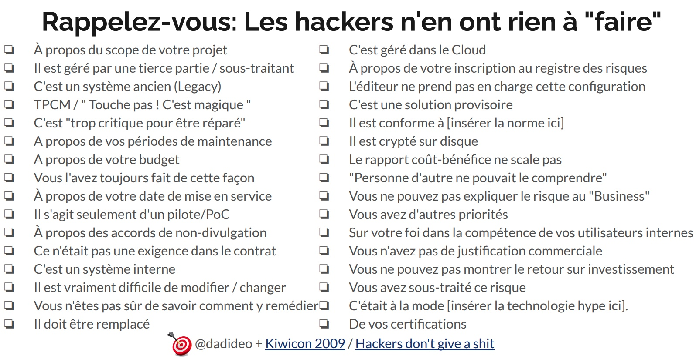

<!-- ------------------------ -->
## Feedback
Duration: 3

Merci pour votre participation **active** et agréable, sur cette très longue durée. Surtout qu'il est bien tard, vous avez bien mérité le déjeuner !

Nous, Christopher et David Aparicio, nous profitons pour remercier infiniment les organisateurs et toute l'équipe de DevoxxFR pour leur aide et leur confiance

Nous vous souhaitons un excellent DevoxxFR 2023 !! ;-)


S'il vous plaît, laissez-nous votre note et vos commentaires sur [OpenFeedBack](https://openfeedback.io/2M9FzZ6xSI2POKX1TrXM/2023-04-13/iWUCq9jRftwiLuxrqhdl)

## E1 - Utip 
Duration: 5

### Utip et Mongopay
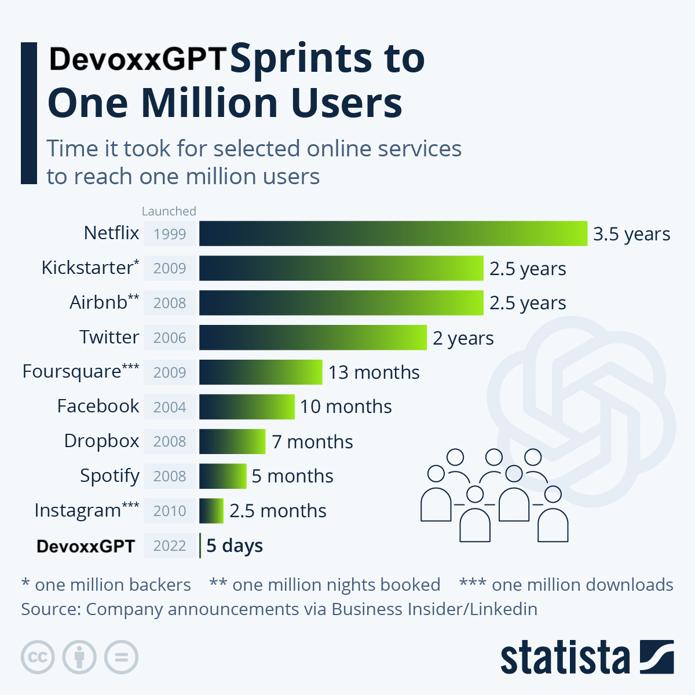

DevoxxGPT connait une croissance incroyable, comme l'illustre le graphique: de nombreux articles en parlent, des directs sur les plateaux télévisés, et même l'[Italie](https://www.bbc.com/news/technology-65139406) menace de vous bloquer, pour des raisons de vie privée.


Mais votre CEO découvre cette [nouvelle](https://www.numerama.com/tech/1325518-utip-ferme-pourquoi-la-plateforme-francaise-de-financement-disparait-elle-si-abruptement.html) avec effroi : "uTip, la plateforme de financement participatif française (Cocorico) concurrente de Tipeee, vient fermer. L’entreprise a été placée en liquidation judiciaire le 23 mars 2023, et son activité s'est arrêtée le 4 avril 2023" ([Source](https://www.numerama.com/tech/1325518-utip-ferme-pourquoi-la-plateforme-francaise-de-financement-disparait-elle-si-abruptement.html)). uTip ferme à cause d'un intermédiaire financier, Mangopay, qui a décidé de mettre fin à leur contrat. Vous avez pour objectif, de le rasurer face à cette triste annonce, ébranlant toute la [French Tech](https://lafrenchtech.com/fr/).

__Objectifs de cette étape__: 
* Identifier le problème rencontré par uTip, le formaliser
* Pour un de vos assets de votre projet, trouver ce genre de problème éventuel et une résolution possible
* Bonus: Pour tous vos prestataires, ou fournisseurs de services (Cloud par exemple), trouvez des alernatives possibles pour éviter de faire banqueroute comme uTip, et ainsi, rassurer votre CEO


<!-- ------------------------ -->
## E2 - MitM
Duration: 5

### Man In The Middle, or not MitM ? (Avons-nous une attaque de type MitM)


Vos développeur.se.s sont inquiet.e.s. Depuis ce vendredi matin, 24 Mars 2023, elles & ils obtiennent ce message d'erreur lors des déploiements CI/CD ou de simples commits sur GitHub.

```Bash
myuser@tatooine ~> git pull origin main
@@@@@@@@@@@@@@@@@@@@@@@@@@@@@@@@@@@@@@@@@@@@@@@@@@@@@@@@@@@
@    WARNING: REMOTE HOST IDENTIFICATION HAS CHANGED!     @
@@@@@@@@@@@@@@@@@@@@@@@@@@@@@@@@@@@@@@@@@@@@@@@@@@@@@@@@@@@
IT IS POSSIBLE THAT SOMEONE IS DOING SOMETHING NASTY!
Someone could be eavesdropping on you right now (man-in-the-middle attack)!
It is also possible that a host key has just been changed.
The fingerprint for the RSA key sent by the remote host is
SHA256:uNiVztksCsDhcc0u9e8BujQXVUpKZIDTMczCvj3tD2s.
Please contact your system administrator.
Add correct host key in /Users/myuser/.ssh/known_hosts to get rid of this message.
Offending RSA key in /Users/myuser/.ssh/known_hosts:5
RSA host key for github.com has changed and you have requested strict checking.
Host key verification failed.
fatal: Could not read from remote repository.

Please make sure you have the correct access rights
and the repository exists.
```

Votre CEO ainsi que votre CTO s'inquiètent. Car ces messages sont bloquants pour les développements ainsi que les déploiements. En tant que Champion de la sécurité, ielles vous demandent d'investiguer sur la cause de ce message d'erreur. Est-ce que votre startup s'est-elle faite attaquée depuis le live sur XFM, hier soir, au JT du 20h ?

__Objectifs de cette étape__: 
* Identifier la cause de ce message d'erreur (Avez-vous trouvé un article qui parle de ce souci ?)
* Etes-vous familié avec le terme ```Man In The Middle``` ? ([Attaque de l'homme du milieu](https://fr.wikipedia.org/wiki/Attaque_de_l%27homme_du_milieu))
* Faut-il accepter cette nouvelle clé ?
* Bonus: Préparer un script qui va, pour une fois (unique), permettre la résolution de l'incident

PS: C'est un évènement daté ^^

<!-- https://github.blog/2023-03-23-we-updated-our-rsa-ssh-host-key/ -->
<!-- ❯ DELETE_LINE=5
sed -i '' "${DELETE_LINE?}d" ~/.ssh/known_hosts -->
<!-- ------------------------ -->